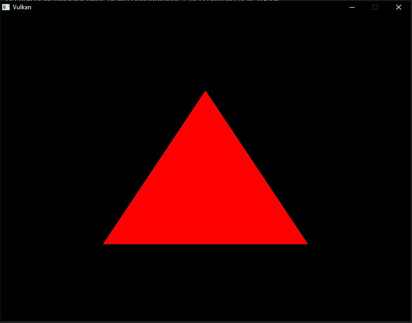
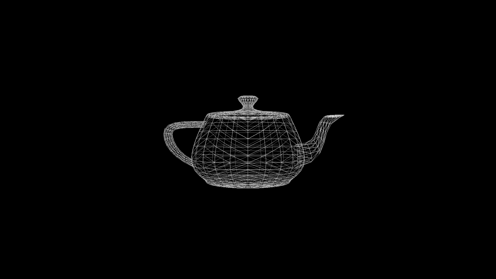
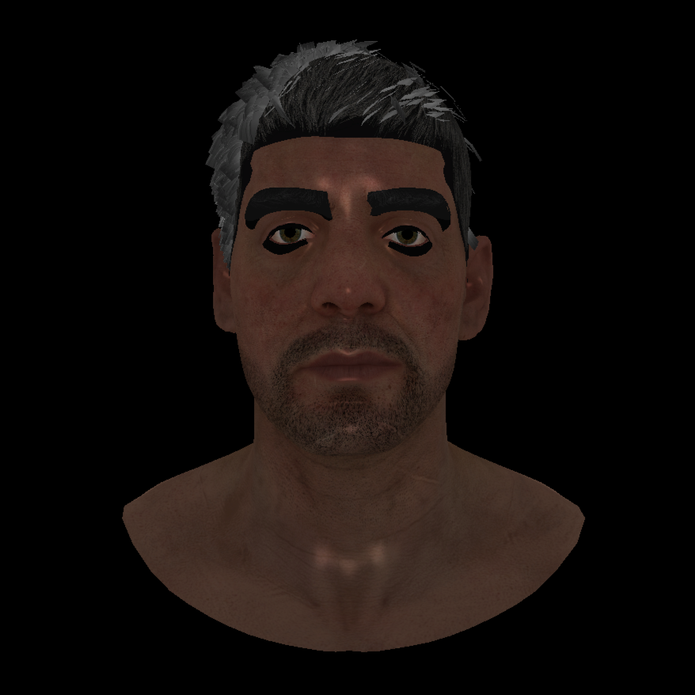
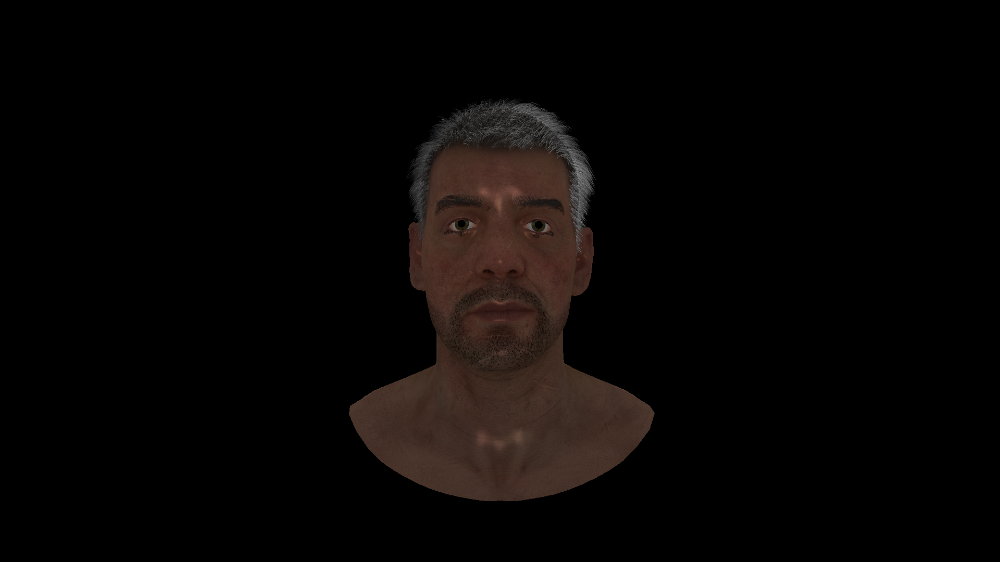

# From OpenGL to Vulkan: API Transition & Complexity Analysis

This repository contains the source code developed for my **Bachelor's Degree Thesis in Computer Science**. The project focus is a comparative analysis between high-level graphics abstractions (OpenGL) and the explicit, low-level control required by the Vulkan API.

## Thesis Context
The project explores the architectural shift in modern graphics programming, focusing on manual resource management, synchronization, and the graphics pipeline. It demonstrates the implementation of a real-time renderer capable of handling vertex transformations and dynamic rotations.

## Technical Implementations (Vulkan)

### 1. Memory & Resource Management
* **Explicit Allocation**: Manual management of GPU memory for Vertex and Index buffers.
* **Descriptor Sets**: Implementation of descriptor pools and layouts for Uniform Buffer Objects (UBOs), used for Model-View-Projection (MVP) matrices.
* **Image Acquisition**: Detailed setup of the Swapchain and Framebuffers for tear-free rendering.

### 2. Synchronization & Performance
* **CPU-GPU Sync**: Robust implementation of **Fences** and **Semaphores** to manage the "In-Flight Frames" logic, preventing race conditions.
* **Command Buffers**: Explicit recording and submission of command buffers to the graphics queue.

### 3. Pipeline & Shaders
* **Shader Workflow**: Integration of SPIR-V compiled shaders (GLSL) into the Vulkan pipeline.
* **Fixed-Function Setup**: Manual configuration of rasterization, multisampling, and depth-stencil testing.

## Project Structure
* `main.cpp`: The core renderer implementation.
* `shaders/`: GLSL Vertex and Fragment shaders.
* *(Note: External libraries like GLFW, GLM, and Vulkan SDK are required but not included in the repository).*

## Rendering Showcase

### From Basic Triangle to 3D Models
| Base Triangle | Textured Mesh | Wireframe Mode |
|:---:|:---:|:---:|
|  |  |  |

### Debugging Spotlight: The "Marius" Case
In my thesis, I analyzed common pitfalls in the Vulkan pipeline. Below is a comparison between a synchronization/indexing error (Marius broken) and the final corrected render.

| Broken Indexing/Sync | Corrected Transformation |
|:---:|:---:|
|  |  |
| *Visualizing pipeline artifacts* | *Final stable render* |
---
*Developed as a Final Degree Project at Università degli Studi di Milano-Bicocca.*